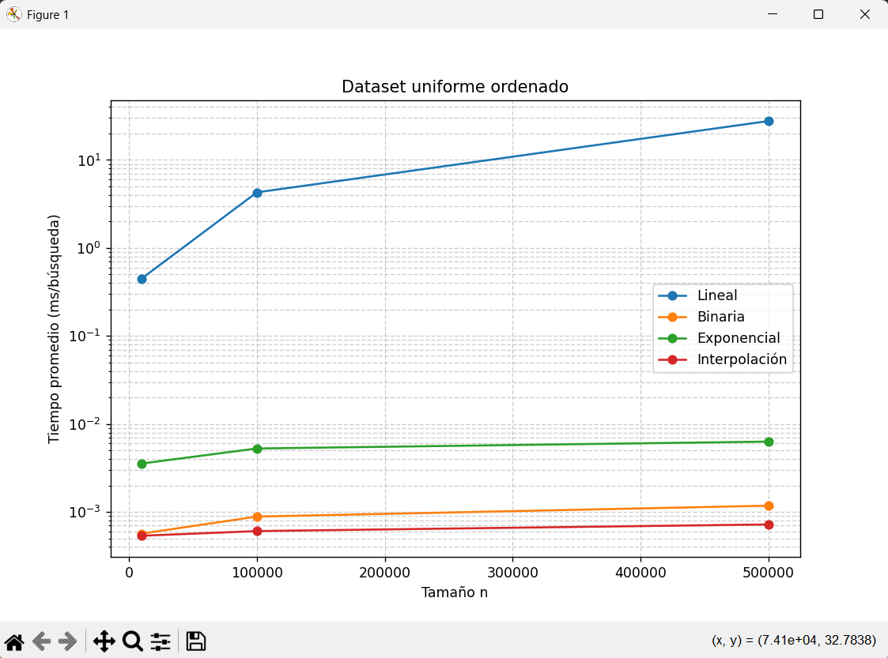
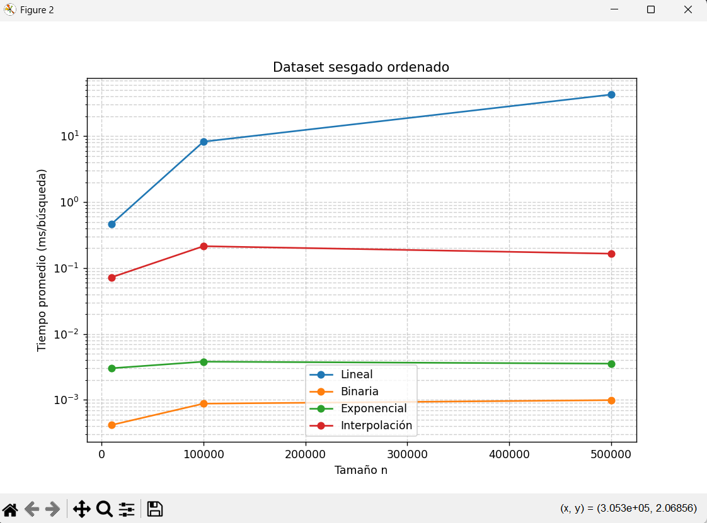
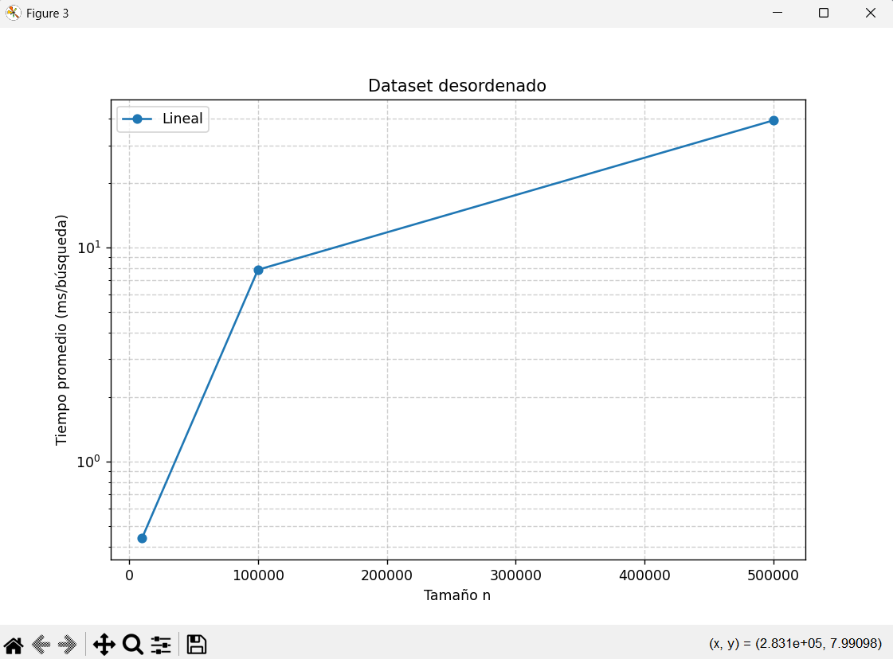

# Práctica 01 — Búsquedas y Notación Asintótica

## 📌 Descripción
Implementación de algoritmos de búsqueda:
- Lineal
- Binaria
- Exponencial
- Interpolación

## 📊 Resultados

### Dataset uniforme


### Dataset sesgado


### Dataset desordenado


## ▶️ Ejecución
```bash
python busquedas.py
python graficas.py
